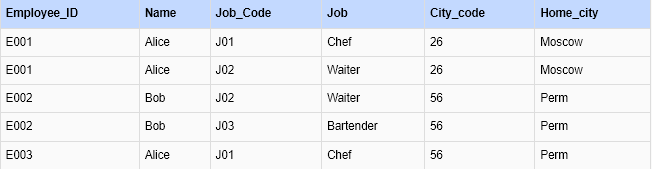
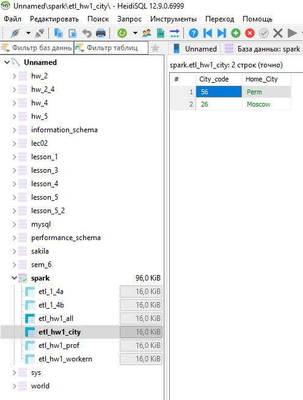
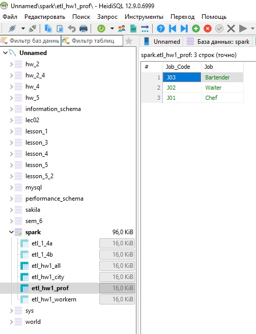
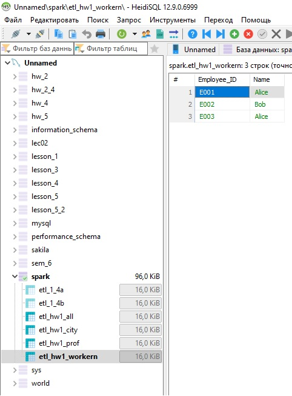

## Домашняя работа 1
#### Задание 1 и 2
На основе задания три создана БД со связями (по Заданию преподавателя).
Скрин из БД

#### Задание 3

Определите в какой нормальной форме данная таблица, приведите её ко 2 и 3 нормальным формам последовательно.

Таблица находится в первой нормальной форме.

