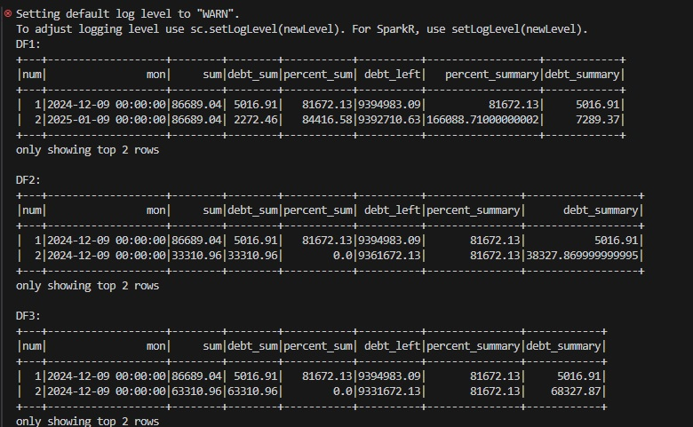
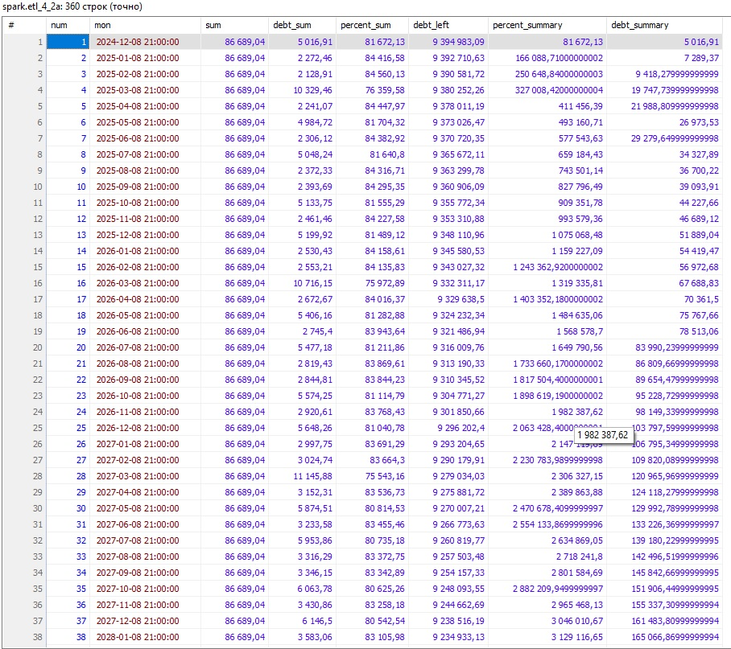
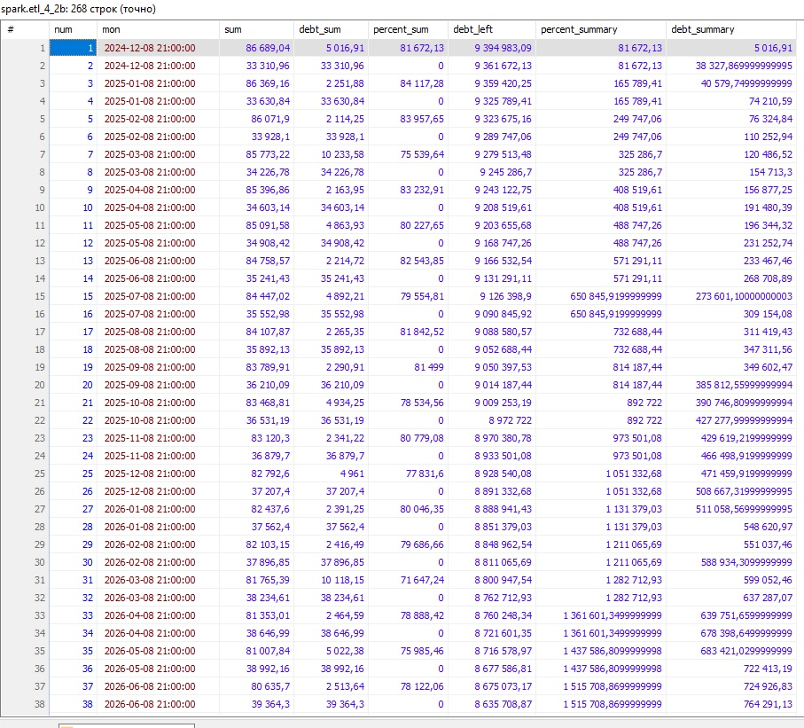
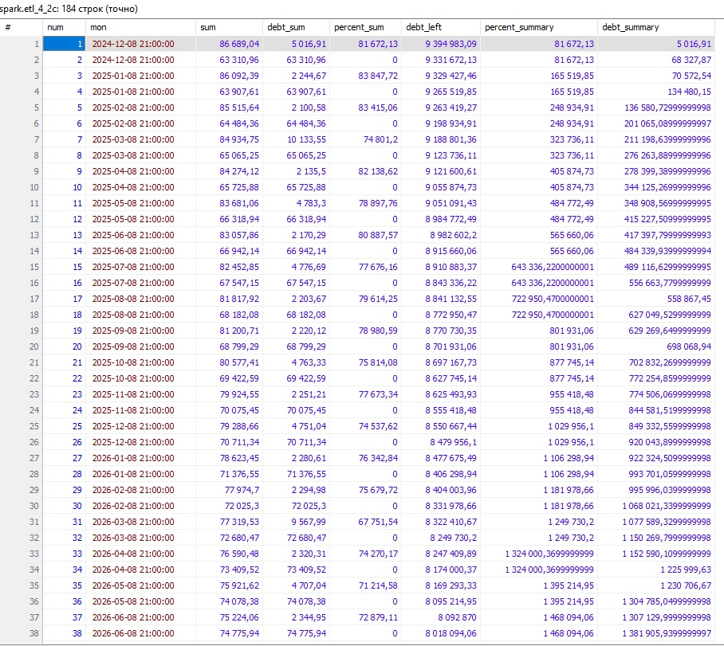
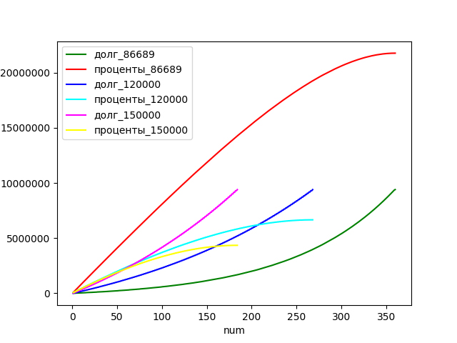

#### Домашняя работа 4

Аналогично работе по семинару 4 на сайте https://calcus.ru/kreditnyj-kalkulyator-s-dosrochnym-pogasheniem добавьте два листа excel 
заполняем варианты платежей 120 и 150 тыс. руб. переносим в таблицы.

Составляем графики досрочного погашения. Линии основного долга и процентов если платеж будет 120 и 150 тыс. руб. Используем разные цвета.

Построение таблиц при запуске

Создание таблиц в БД

Графики

