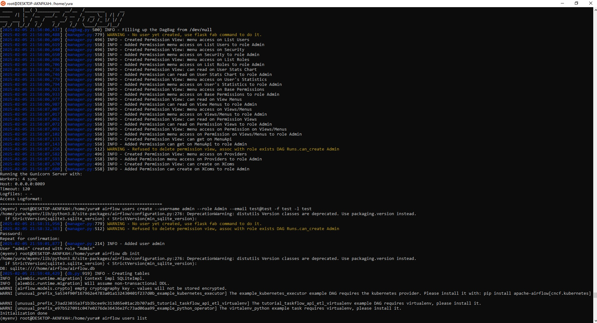
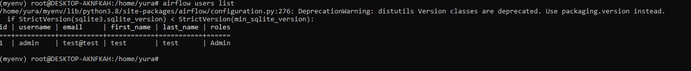
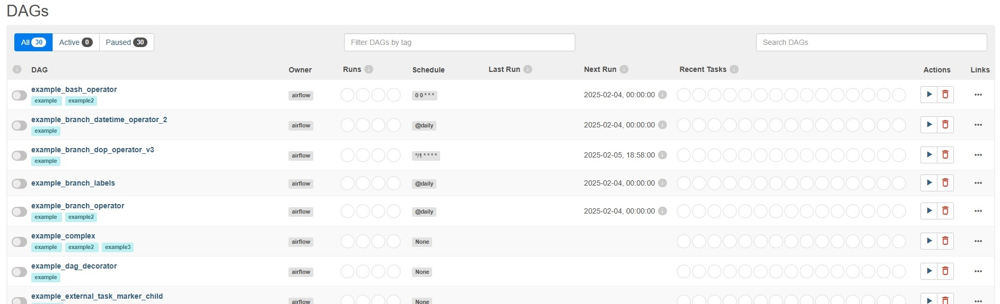

#### Домашняя работа 5
Домашнее задание по семинару 5 от преподавателя установить и запусить airflow
на своем ПК.

Установка airflow на ubuntu под windows

Запуск airflow 

Добавление пользователя Admin

Просмотр задач в меню airflow

