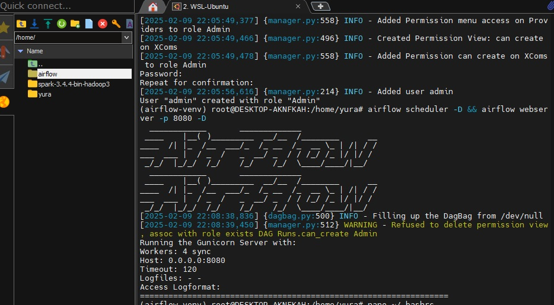
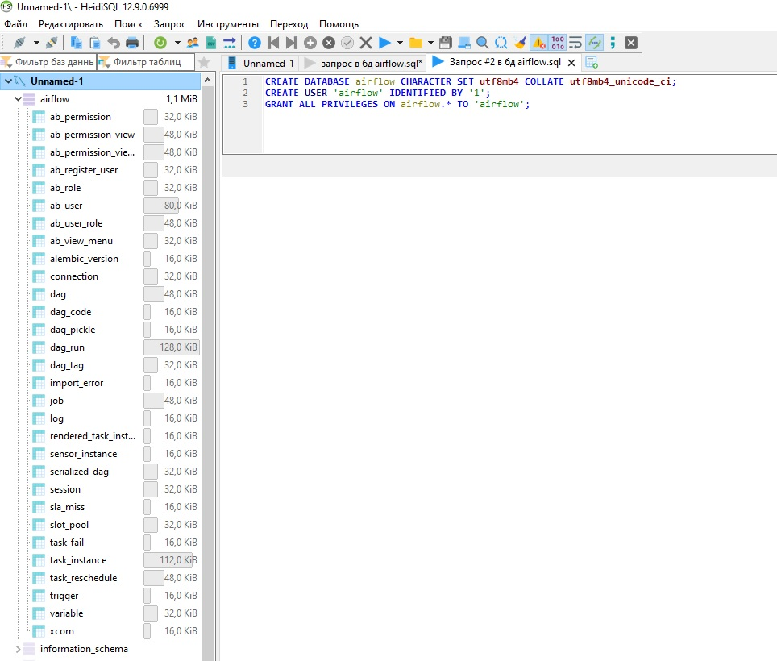
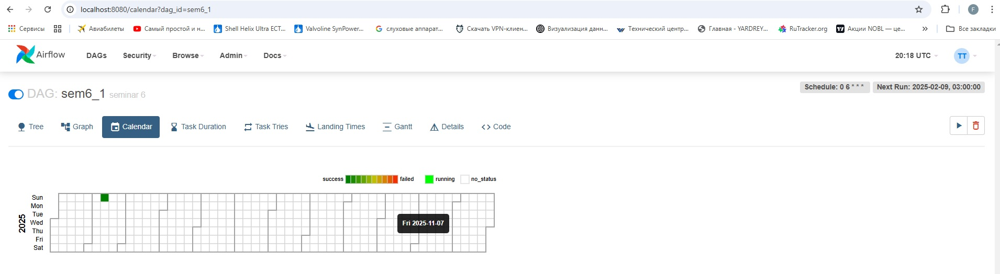
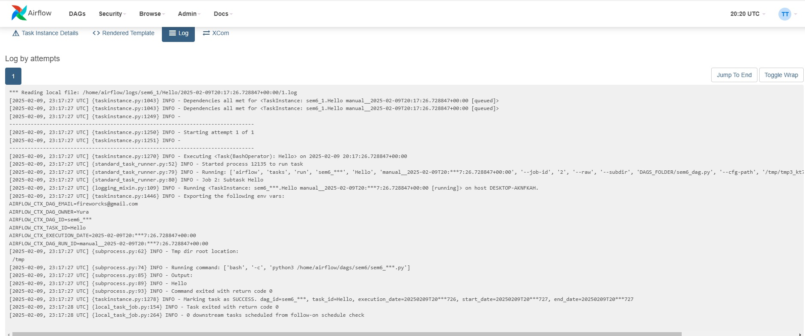
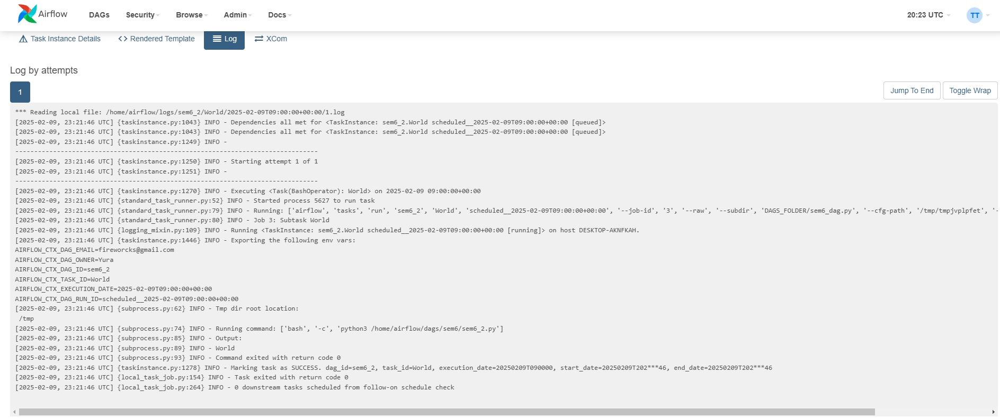
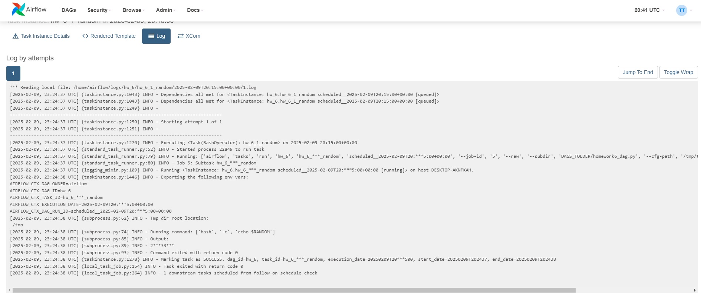
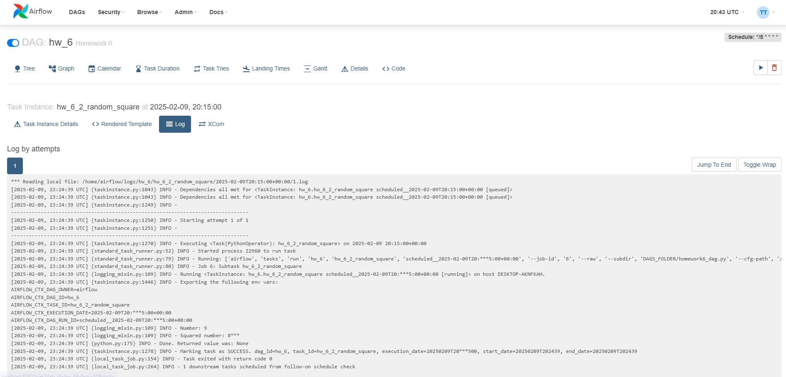

#### Домашняя работа 6
По семинару 6 нужно было установить arflow, mysql, spark

установка спарка и айрфлоу

Конект БД с айрфлоу (созданы таблицы)

Также было задание от преподавателя запустить даг с семинара

Запуск дага 

Лог первого дага

Лог второго дага запуска

Лог по заданию: Создайте новый граф. Добавьте в него BashOperator, который будет генерировать рандомное число и печатать его в консоль.

Лог по заданию: Создайте PythonOperator, который генерирует рандомное число, возводит его в квадрат и выводит в консоль исходное число и результат.

