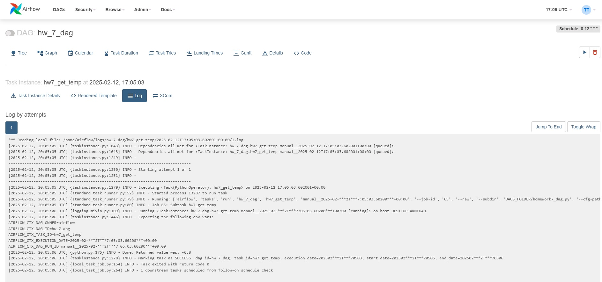
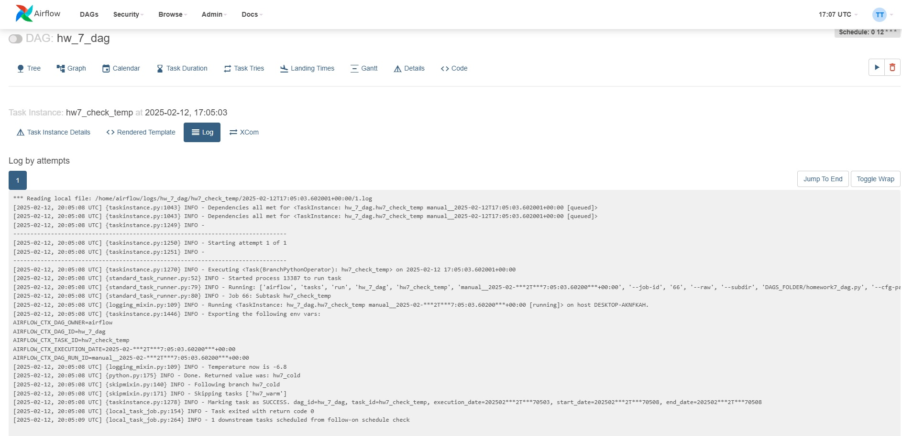
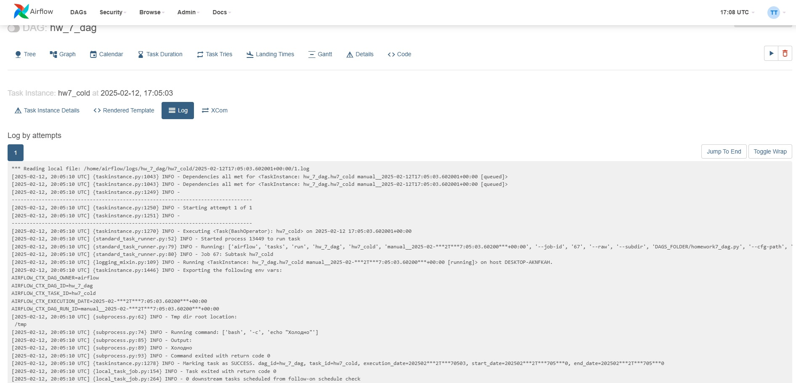

#### Домашняя работа 7
— Зарегистрируйтесь в ОрепWeatherApi (https://openweathermap.org/api) — Создайте ETL, который получает температуру в заданной вами локации, и дальше делает ветвление:

1)В случае, если температура больше 15 градусов цельсия — идёт на ветку, в которой есть оператор, выводящий на экран «тепло»; 

2) В случае, если температура ниже 15 градусов, идёт на ветку с оператором, который выводит в консоль «холодно».

Оператор ветвления должен выводить в консоль полученную от АРI температуру.

Так как ОрепWeatherApi (https://openweathermap.org/api) платный, а второй сайт с 6 семинара https://goweather.herokuapp.com/ не работает у меня.

Я выбрал бесплатный API -> https://open-meteo.com/en/docs#latitude=55.7522&longitude=37.6156&current=&minutely_15=&hourly=temperature_2m&daily=&models=

И на его основе снимал получал погодные значения.

Дерево ветвления

Лог с температурой

Лог с переходом "холодно" или "тепло"

Лог с выводом "холодно"

