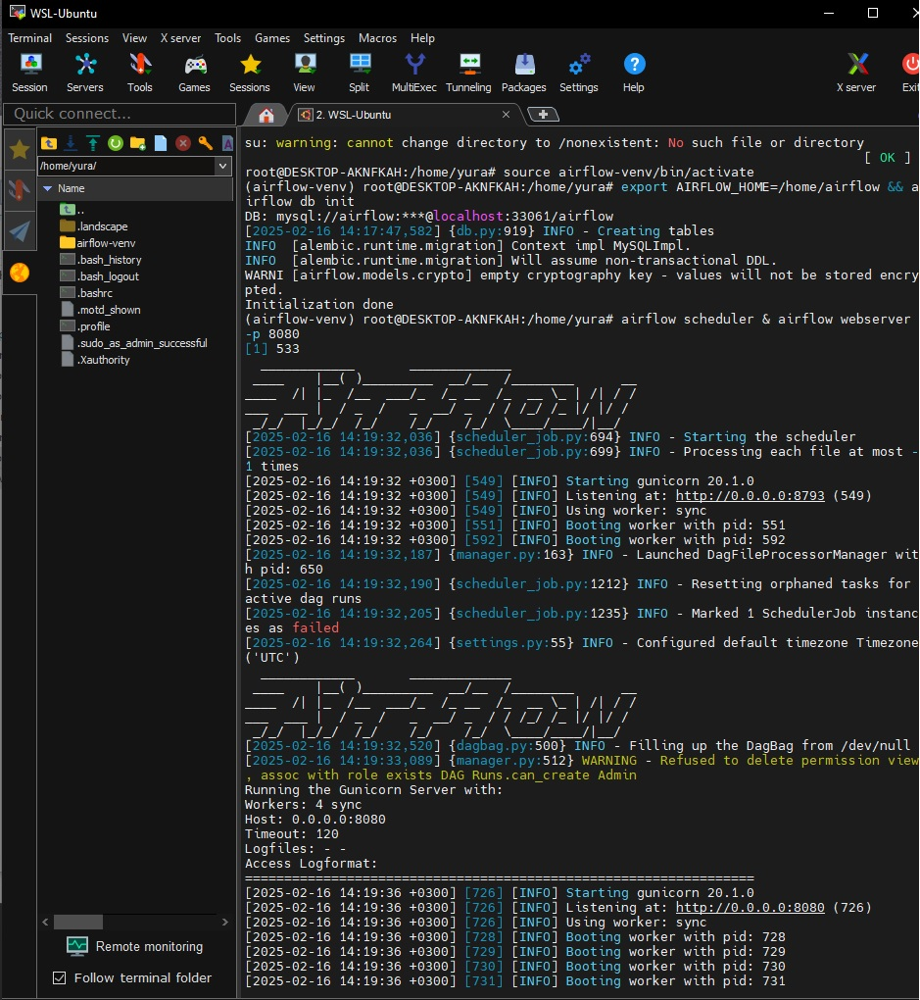
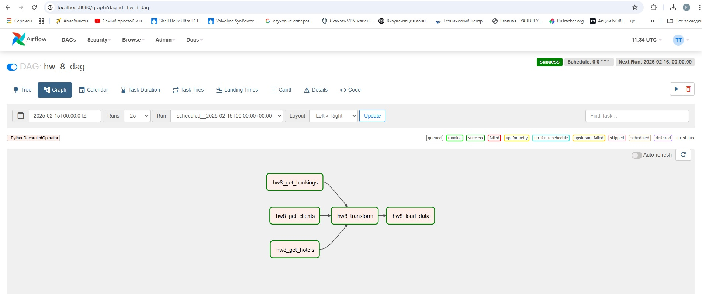
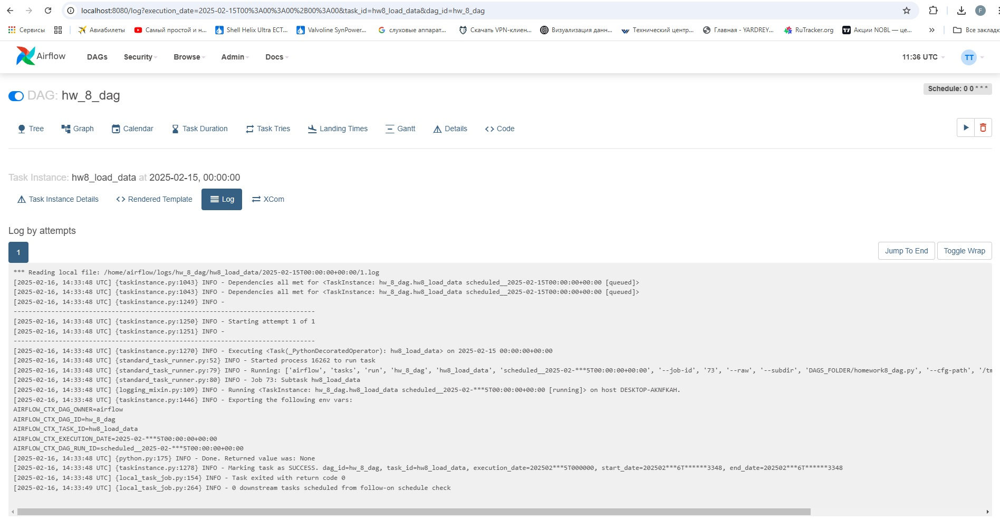
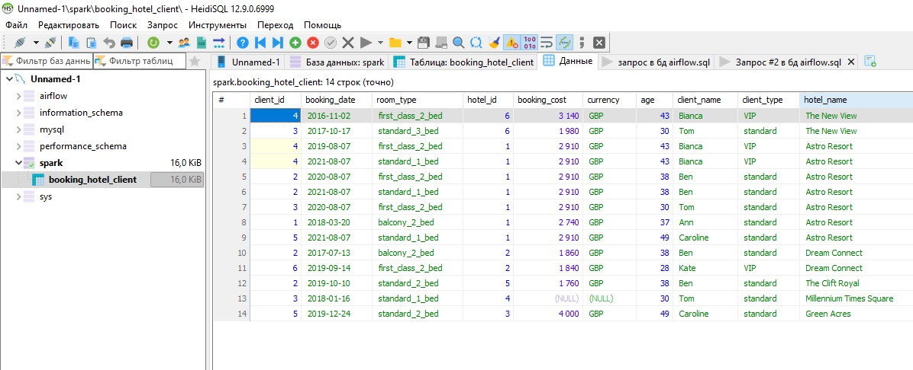

#### Домашняя работа 8
Задание:

1. Скачайте файлы boking.csv, client.csv и hotel.csv;
2. Создайте новый dag;
3. Создайте три оператора для получения данных и загрузите файлы. Передайте дата фреймы в оператор трансформации;
4. Создайте оператор который будет трансформировать данные:
— Объедините все таблицы в одну;
— Приведите даты к одному виду;
— Удалите невалидные колонки;
— Приведите все валюты к одной;
5. Создайте оператор загрузки в базу данных;
6. Запустите dag.

---
Запуск айрфлоу
1. sudo su
2. sudo service mysql status
3. sudo service mysqq start
4. source airflow-venv/bin/activate
5. export AIRFLOW_HOME=/home/airflow && airflow db init
6. airflow scheduler & airflow webserver -p 8080

Лог запуска airflow

Дерево процесса

Лог выполнения задачи

Созданная таблица в базе данных

